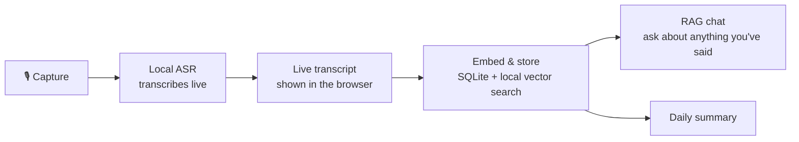

<div align="center">
  
  <h1>EchoMemory</h1>
  <p><strong>Your conversations, made searchable.</strong></p>
  <p>
    <a href="https://github.com/nirbhay41120003/EchoMind">Site</a> ·
    <a href="#how-it-works">How it works</a> ·
    <a href="#features">Features</a> ·
    <a href="#quick-start-macos">Quick start</a>
  </p>
  <p>
    
    
    
    
  </p>
</div>

<div align="center">
  <video src="assets/echomemory-demo.mp4" controls muted playsinline width="100%"></video>
</div>

EchoMemory is a local-first voice memory assistant:

We speak far more than we write, and almost none of it is kept. EchoMemory
listens when you tell it to,
transcribes what's said, quietly turns the meaningful parts into searchable
long-term memory, and lets you ask questions about anything you've said —
grounded in what you actually said, not a guess.

It was built with people who have hearing difficulties in mind — as a smart
assistant that helps you keep track of conversations, not a hearing aid
device — but it's useful for anyone who forgets things they meant to
remember.

Everything runs on your machine. No cloud speech, embedding, or chat calls
by default, and nothing leaves your device unless you explicitly turn on
the optional Sarvam integration and supply your own key.


---

## Why EchoMemory

We generate a huge amount of information through everyday conversation and
explicitly save almost none of it. A name mentioned once, a plan made in
passing, a detail from a call — most of it is gone by the next day.
EchoMemory captures it once, so you don't have to remember to write it down.

## How it works



1. **Capture** — click to start listening in the browser; nothing is
   captured until you do.
2. **Transcribe** — a local ASR model converts speech to text in
   near-real-time, streamed to the UI as it's spoken.
3. **Store** — finalized transcript segments are embedded locally and
   saved to SQLite alongside timestamps, so every memory is searchable
   later and traceable back to when it was said.
4. **Retrieve & chat** — ask a question in plain language; EchoMemory
   retrieves the relevant transcript chunks and answers using a local
   chat model, grounded in what was actually said.

## Features

- 🎙️ **Live browser capture** — click Capture, see the transcript appear
  as you speak, no round trip to a server.
- 🔍 **Local semantic search** — SQLite-backed memory store with local
  embeddings and a deterministic fallback if a model isn't loaded yet.
- 🧠 **Grounded RAG chat** — query your own memory instead of guessing;
  answers are backed by retrieved transcript context.
- 📦 **No silent downloads** — every model is fetched explicitly from the
  in-app **Local model setup** panel. Nothing downloads in the background.
- 🧩 **Pluggable local models** — local GGUF chat models for answers and
  transcript cleanup, with native Nemotron and Fun-ASR runtimes available
  for faster on-device transcription.
- 🌐 **Optional cloud speech** — Sarvam Saaras v3 for Indian-language
  speech, entirely opt-in and only active once you add your own key.
- 🔒 **Local by default** — your data lives on your machine unless you
  choose otherwise.

## Requirements

- Python 3.12–3.14 on macOS
- 4 GB RAM minimum (more for larger local models)
- Docker Desktop 4.x+ if you'd rather run it in a container

## Quick start (macOS)

```bash
git clone https://github.com/nirbhay41120003/EchoMind.git
cd EchoMemory
python3 -m venv .venv
source .venv/bin/activate
python -m pip install --upgrade pip
python -m pip install -r requirements.txt
./scripts/install_native_runtimes.sh
python -m uvicorn app.main:app --reload
```

Open **http://127.0.0.1:8000**, allow microphone access, and go to
**More → Local model setup** to download the recommended Whisper and
embedding models. Model files live under `models/`; your memory data and
settings live under `data/` (or the OS user data directory). Both are
gitignored — your data never gets committed.

> **Apple Silicon note:** `llama-cpp-python` may need to compile locally.
> If so, install the command-line tools first:
> ```bash
> xcode-select --install
> ```

## Quick start (Docker)

```bash
git clone https://github.com/nirbhay41120003/EchoMind.git
cd EchoMemory
docker build -t echomemory .
docker run --rm -p 8000:8000 \
  -v echomemory-data:/app/data \
  -v echomemory-models:/app/models \
  echomemory
```

Open **http://127.0.0.1:8000**. Named volumes persist your database,
settings, and downloaded models across upgrades. The image runs as a
non-root user, and browser microphone access works through `localhost` in
Docker Desktop.

## Model setup

Model downloads happen from inside the app, after dependencies are
installed — see [MODEL_SETUP.md](MODEL_SETUP.md) for supported model
families, offline setup, and the native Nemotron / Fun-ASR runtimes. The
macOS install script places both native runtimes under `.local/`; the
Docker image builds and includes them automatically.

## Configuration

| Variable | Default | Purpose |
| --- | --- | --- |
| `ECHOMEMORY_DB` | `data/echomemory.sqlite3` | SQLite database location |
| `ECHOMEMORY_MODELS_DIR` | `models/` | Downloaded model directory |
| `ECHOMEMORY_ASR_MODEL` | empty | Existing local Whisper model path |
| `ECHOMEMORY_EMBEDDING_MODEL` | empty | Existing local embedding model path |
| `ECHOMEMORY_LLM_MODEL` | empty | Existing local GGUF chat model path |
| `ECHOMEMORY_DEVICE` | `cpu` | ASR device |

Sarvam credentials are entered through the UI and stored with restrictive
local permissions where the OS supports it. **Never** put a real key in an
environment file, screenshot, issue, test, or commit.

## Development and verification

```bash
python -m unittest discover -s tests -v
python scripts/check_public_repo.py
```

The public-repo check requires an initialized Git checkout and rejects
tracked databases, model files, local binaries, `.env` files, and common
credential markers before you push. Read [SECURITY.md](SECURITY.md) before
publishing changes.

## Project layout

```text
app/                    FastAPI server, local inference adapters, and web UI
tests/                  Standard-library unit tests
requirements*.txt       Reproducible Python dependency sets
Dockerfile              Non-root container image
MODEL_SETUP.md          Model downloads and native runtime setup
SECURITY.md             Public-repository and credential guidance
```

## Contributing

Issues and pull requests are welcome — whether that's a bug report, a new
local model backend, or UI polish. If you're picking this up for the first
time, `MODEL_SETUP.md` and `SECURITY.md` are the two files worth reading
before your first PR.

## License

See [LICENSE](LICENSE) for terms.
